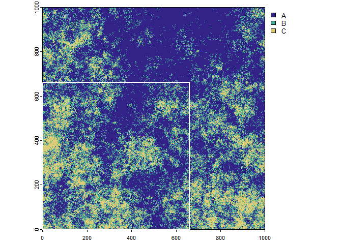
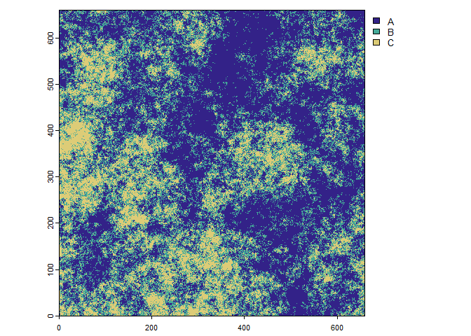
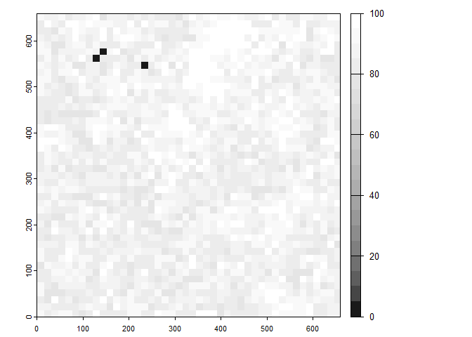

<!-- README.md is generated from README.Rmd. Please edit that file -->

# landscapeScaling

<!-- badges: start -->

[](https://github.com/gannd/landscapeScaling/actions/workflows/R-CMD-check.yaml)
<!-- badges: end -->

The purpose of the “landscapeScaling” package is to provide methods and
functions to upscale categorical raster data. The recommended method is
the multi-dimensional grid-point (mdgp) scaling algorithm. It generates
a new classification scheme on the basis of user desired class label
precision of mixed classes and representativeness of the scaled class
across the landscape of interest. The scaling output includes scaled
categorical raster maps with mixed classes, a corresponding continuous
raster with information retention calculations for each scaled grid cell
and class-specific and landscape-scale information retention mean and
standard deviation. The alternative method available in the package that
does not modify the classification scheme is the majority (plurality)
rule.

## Installation

You can install the development version of landscapeScaling from
[GitHub](https://github.com/) with:

``` r
# install.packages("devtools")
devtools::install_github("gannd/landscapeScaling")
```

``` r
library(landscapeScaling)
library(terra)
#> terra 1.6.17
```

## Example

For demonstration purpose we will load a package provided landscape with
three classes and first subset the original raster to the lower left
chunk of 90,000 grid cells (300 by 300 cells).

``` r
# three class color scheme
clr <- c('#332288','#44AA99','#DDCC77')

# scaled color scheme
clr_scale <- c('#E69F00','#56B4E9','#009E73','#F0E442','#0072B2','#D55E00')

# load categorical raster data set and plot
r <- terra::rast(system.file("extdata/nlm_mid_geom_r3_sa0.tif", package = "landscapeScaling"))
terra::plot(r, col=clr,mar=c(1.5,1.5,0.75,5))

# generate subset extent to the lower left 300 by 300 cells (demo purpose) and add to plot
sub_ext <- terra::ext(0,300,0,300)
terra::plot(sub_ext, border='white',lwd=2,add=TRUE)
```



The original raster with three classes and the subset extent in the
lower left corner (outline in white).

``` r
# subset the landscape and plot 
r_sub <- terra::crop(r,sub_ext)
terra::plot(r_sub,col=clr,mar=c(1.5,1.5,0.75,5))
```



The subset of the categorical raster.

#### Scaling Process Steps

1)  Generate the scaled grid with the “scale_grid” function applying a
    scale factor of 15. First the lower left corner of the 15 by 15 grid
    cells will be generated.

``` r
LL_pnts <- scale_grid(r_sub,scale_factor=15)
head(LL_pnts)
#>    x y
#> 1  0 0
#> 2 15 0
#> 3 30 0
#> 4 45 0
#> 5 60 0
#> 6 75 0
terra::plot(r_sub,col=clr,mar=c(1.5,1.5,0.75,5))
terra::plot(vect(LL_pnts,geom=c("x","y")),pch=3,col='#EEEEEE',add=TRUE)
```


The subset of the categorical raster and the scaled grid cell origin
(lower left corners)

2)  Generate relative abundance for the subset for a scale factor of 15.
    First the lower left corner of the 15 by 15 grid cells will be
    generated. The relative abundance for each of the 400 scaled grid
    cells and the relative abundances are returned as a data frame.

``` r
rel_abund <- relative_abundance_scaled_grid(r_sub,class_field='cover',scale_factor=15)
head(rel_abund)
#>    x y          A        B        C
#> 1  0 0  4.8888889 38.22222 56.88889
#> 2 15 0 10.2222222 38.66667 51.11111
#> 3 30 0 20.0000000 42.66667 37.33333
#> 4 45 0 24.8888889 40.44444 34.66667
#> 5 60 0  0.8888889 28.00000 71.11111
#> 6 75 0 17.7777778 37.33333 44.88889
```

3)  Classify the relative abundance of each scaled grid cell to a list
    of multi-dimensional grid points that are generated from the class
    label precision parameter $parts$ and the landscape richness (number
    of classes). The mdgp_scale” function requires the argument $parts$
    for the class label precision, the representativeness threshold
    $prp-threshold$, and the monotypic class threshold
    $monotypic-threshold$. First multi-dimensional grid points are
    gnerated, then each grid cell is classified to the grid point that
    maximizes information retention.

``` r
# classify relative abundance samples to multidimensional grid points with a 33.3% class label precision and a 10 percent representativeness threshold and a monotypic class threshold of 90%
mdgp_result <- mdgp_scale(rel_abund,parts=3,rpr_threshold=10,monotypic_threshold=90)
#> [1] "number of cells: 400"
#> [1] "number of grid points: 10"
#> [1] "number of grid points remaining: 5"
head(mdgp_result)
#>   cls      A      B      C    x_y prc_inf_agr class_name
#> 1  10  0.000  8.444 91.556  285_0      91.556       C100
#> 2  10  0.000  9.333 90.667 195_30      90.667       C100
#> 3  10  0.444 12.444 87.111 60_285      87.111       C100
#> 4   9  4.889 38.222 56.889    0_0      90.222  C67_x_B33
#> 5   9 10.222 38.667 51.111   15_0      84.444  C67_x_B33
#> 6   9 10.667 42.667 46.667  225_0      80.000  C67_x_B33
```

4)  Convert classified points to raster and location-specific
    information retention and summarize information retention at the
    class-level and across the scaled landscape with the function
    scaling_result_to_raster().

``` r
# convert classified points and location-specific information retention to raster
mdgp_raster <- scaling_result_to_raster(mdgp_result,class_name_field='class_name',scale_factor=15)

# plot the scaled map
terra::plot(mdgp_raster[[1]],col=clr_scale,mar=c(1.5,1.5,1,8))
```


The scaled categorical raster with scaled classification scheme.

``` r
# plot information retention of the scaled map
terra::plot(mdgp_raster[[2]],col=gray.colors(20,start=0.1,end=1),mar=c(1.5,1,1,8))
```



Information retention raster at the scaled grid cell level.

``` r
# print the class-specific and landscape scale summary statistics 
print(mdgp_raster[[3]])
#> [[1]]
#>        class_name freq class_id   prop inf_retention_mn inf_retention_sd
#> 1 A33_x_B33_x_C33  165        1 0.4125           84.129            3.814
#> 2       A67_x_B33  122        2 0.3050           87.417            6.519
#> 3       B67_x_A33   29        3 0.0725           82.038            2.214
#> 4            C100    3        4 0.0075           89.778            2.352
#> 5       C67_x_B33   81        5 0.2025           88.093            5.132
#> 
#> [[2]]
#>                                   mean    sd
#> information_retention_landscape 85.826 5.356
```
